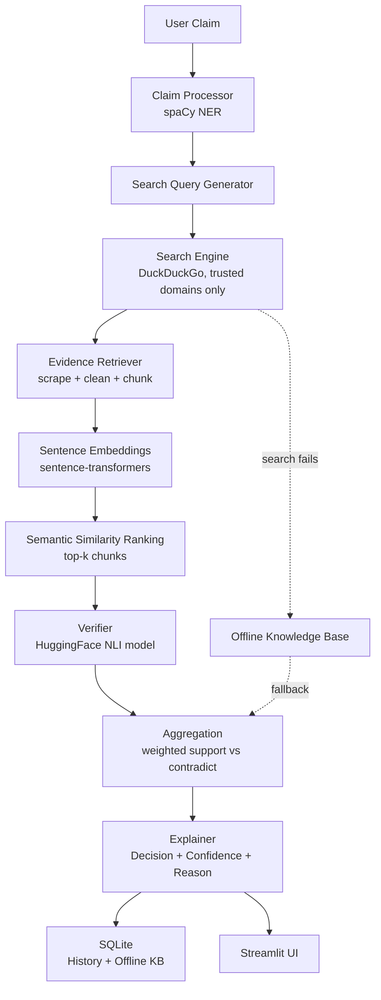
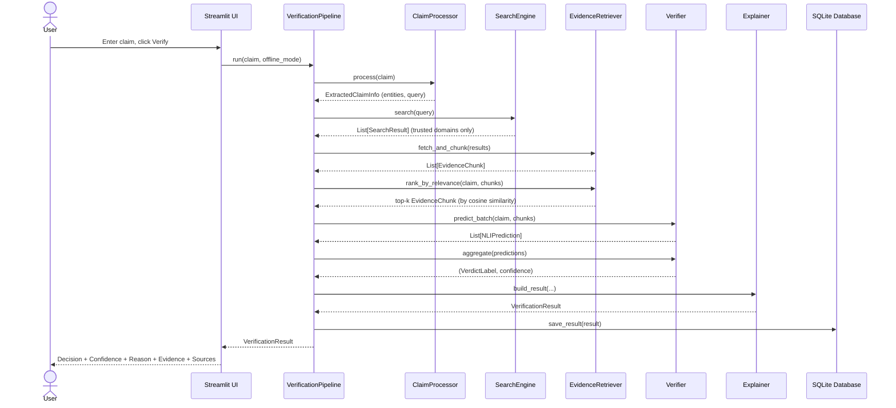
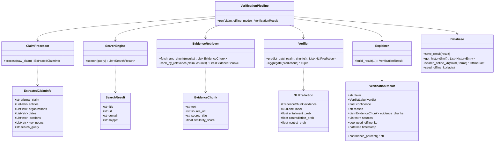

# VeriFact AI 🔍

**An explainable, evidence-based fact verification assistant.**

VeriFact AI takes a natural-language factual claim, searches trusted sources
(.gov, .edu, WHO, NASA, UN, Britannica, Wikipedia, and similar), retrieves
relevant evidence, and uses a real NLP pipeline — not a single "ask an LLM"
call — to classify the claim as **Supported**, **Contradicted**, or
**Insufficient Evidence**, with a full explanation, supporting evidence, and
confidence score.

Built as a school AI exhibition project.

---

## Table of Contents

1. [Features](#features)
2. [Architecture](#architecture)
3. [Pipeline Sequence](#pipeline-sequence)
4. [Class Diagram](#class-diagram)
5. [Database Schema](#database-schema)
6. [Installation](#installation)
7. [Usage](#usage)
8. [Sample Data](#sample-data)
9. [Testing](#testing)
10. [API Documentation (internal modules)](#api-documentation-internal-modules)
11. [Deployment](#deployment)
12. [Future Improvements](#future-improvements)
13. [Disclaimer](#disclaimer)

---

## Features

- 🔎 **Real fact-verification pipeline** — NER → trusted search → scraping → semantic retrieval → NLI classification → aggregation, not a single LLM prompt.
- 🧠 **Explainable AI** — every result includes Decision, Confidence, Reason, Evidence, and Sources.
- 🌐 **Trusted-domain-only search** — results are filtered to `.gov`, `.edu`, WHO, NASA, UN, Britannica, Wikipedia, and other reputable sources.
- 📡 **Offline Mode** — falls back to (or can be forced to use) a local SQLite knowledge base of 80 curated, pre-verified facts when the internet is unavailable.
- 📊 **Confidence visualization** — a simple bar shows how confident the model is in its verdict.
- 🕘 **History** — every query is saved and browsable.
- 📄 **PDF export** — download any result as a one-page report.
- 📋 **Copy result** — one-click copyable plain-text summary.
- 🖥️ **Modern Streamlit UI** — responsive, dark-mode compatible, clean layout.

---

## Architecture



**Module responsibilities:**

| Module | Responsibility |
|---|---|
| `core/claim_processor.py` | spaCy NER, entity extraction, search query generation |
| `core/search_engine.py` | DuckDuckGo search + trusted-domain filtering |
| `core/evidence_retriever.py` | Scraping, text cleaning, chunking, embeddings, semantic ranking |
| `core/verifier.py` | HuggingFace NLI inference + weighted aggregation |
| `core/explainer.py` | Builds the final explainable `VerificationResult` |
| `core/database.py` | SQLite persistence: history + offline knowledge base |
| `core/pipeline.py` | Orchestrates all of the above end-to-end |
| `ui/components.py` | Reusable Streamlit widgets (cards, PDF export, history list) |
| `app.py` | Streamlit page layout and app entry point |

---

## Pipeline Sequence



---

## Class Diagram



---

## Database Schema

Two separate SQLite databases (see `config/settings.yaml`):

**`data/history.db`**
```sql
CREATE TABLE history (
    id INTEGER PRIMARY KEY AUTOINCREMENT,
    claim TEXT NOT NULL,
    verdict TEXT NOT NULL,          -- Supported / Contradicted / Insufficient Evidence
    confidence REAL NOT NULL,       -- 0.0 - 1.0
    reason TEXT NOT NULL,
    sources TEXT NOT NULL,          -- comma-separated URLs
    used_offline_kb INTEGER NOT NULL DEFAULT 0,
    timestamp TEXT NOT NULL         -- ISO-8601
);
```

**`data/offline_facts.db`**
```sql
CREATE TABLE offline_facts (
    id INTEGER PRIMARY KEY AUTOINCREMENT,
    claim_text TEXT NOT NULL UNIQUE,
    verdict TEXT NOT NULL,
    explanation TEXT NOT NULL,
    source TEXT NOT NULL,
    category TEXT NOT NULL DEFAULT 'general'  -- geography / science / space / history / organizations
);
```

---

## Installation

**Requirements:** Python 3.12+

```bash
# 1. Clone / unzip the project, then move into it
cd verifact_ai

# 2. Create a virtual environment (recommended)
python3 -m venv venv
source venv/bin/activate        # Windows: venv\Scripts\activate

# 3. Install dependencies
pip install -r requirements.txt

# 4. Download the spaCy language model (required for NER)
python -m spacy download en_core_web_sm

# 5. Seed the offline knowledge base (80 pre-verified facts)
python data/load_seed_data.py

# 6. Run the app
streamlit run app.py
```

The app opens at `http://localhost:8501`. The first claim you verify will be
slower than subsequent ones — the embedding and NLI models are downloaded
from HuggingFace and cached locally the first time they're loaded.

---

## Usage

1. Open the app and go to **Verify a Claim** (default page).
2. Type a factual claim, e.g. `"The Eiffel Tower is located in Berlin."`
3. Click **Verify**.
4. Read the Decision, Confidence, Reason, Evidence, and Sources.
5. Optionally export the result as a PDF, or copy it as text.
6. Check **History** in the sidebar to revisit past queries.
7. Toggle **Offline Mode** in the sidebar to answer only from the local
   knowledge base (useful with no internet connection).

---

## Sample Data

`data/seed_facts.py` contains 80 curated, verified facts across five
categories — geography, science, space, history, and organizations — each
with a verdict, explanation, and source. This structure is intentionally
easy to extend: append more `(claim, verdict, explanation, source)` tuples
to any category list (or add a new category) and re-run
`python data/load_seed_data.py` to reload the offline knowledge base.

---

## Testing

```bash
pytest
```

Unit tests cover pure logic (text chunking, query generation, domain trust
filtering, NLI aggregation math, database persistence, explanation
building) using mocks for heavy AI models so the suite runs in seconds
without needing model downloads.

Tests marked `@pytest.mark.integration` require the actual spaCy model to
be installed and are skipped by default unless run explicitly:

```bash
pytest -m integration
```

---

## API Documentation (internal modules)

VeriFact AI is a self-contained desktop/local-server app, not a hosted web
API — but its `core/` modules are designed as clean, reusable Python
interfaces. Summary:

### `core.pipeline.VerificationPipeline`
```python
pipeline = VerificationPipeline()  # loads all AI models once
result: VerificationResult = pipeline.run(claim: str, offline_mode: bool = False)
```

### `core.claim_processor.ClaimProcessor`
```python
processor = ClaimProcessor()
info: ExtractedClaimInfo = processor.process(raw_claim: str)
```

### `core.search_engine.SearchEngine`
```python
engine = SearchEngine()
results: list[SearchResult] = engine.search(query: str)
```

### `core.evidence_retriever.EvidenceRetriever`
```python
retriever = EvidenceRetriever()
chunks: list[EvidenceChunk] = retriever.fetch_and_chunk(results)
ranked: list[EvidenceChunk] = retriever.rank_by_relevance(claim, chunks)
```

### `core.verifier.Verifier`
```python
verifier = Verifier()
predictions: list[NLIPrediction] = verifier.predict_batch(claim, ranked_chunks)
verdict, confidence = verifier.aggregate(predictions)
```

### `core.explainer.Explainer`
```python
explainer = Explainer()
result: VerificationResult = explainer.build_result(claim, verdict, confidence, predictions)
```

### `core.database.Database`
```python
db = Database()
db.save_result(result)
history = db.get_history(limit=50)
fact = db.search_offline_kb(claim, search_terms)
```

All public methods have docstrings and full type hints — see the source
files in `core/` for parameter and return type details.

---

## Deployment

**Local demo (recommended for an exhibition):**
```bash
streamlit run app.py
```
Runs entirely on a laptop; no external accounts or API keys required.

**Streamlit Community Cloud:**
1. Push this repository to GitHub.
2. Add a `packages.txt` file (not included by default) if the host needs
   system-level build tools for `torch`/`spacy`.
3. On [share.streamlit.io](https://share.streamlit.io), connect the repo and
   set the main file to `app.py`.
4. Add a post-install step (or a `setup.sh` run via a build hook) to run
   `python -m spacy download en_core_web_sm` and
   `python data/load_seed_data.py`, since these don't happen automatically
   from `requirements.txt` alone.

**Docker (optional, for a portable exhibition booth setup):**
```dockerfile
FROM python:3.12-slim
WORKDIR /app
COPY . .
RUN pip install --no-cache-dir -r requirements.txt \
    && python -m spacy download en_core_web_sm \
    && python data/load_seed_data.py
EXPOSE 8501
CMD ["streamlit", "run", "app.py", "--server.address=0.0.0.0"]
```

---

## Future Improvements

- Expand the offline knowledge base beyond 80 facts (structure already supports this).
- Add caching of live-fetched evidence (by URL) to avoid re-scraping the same page across sessions.
- Multi-claim / paragraph-level verification (split a paragraph into individual checkable claims).
- Support for image-based claims (e.g. verify captions against reverse image search).
- User feedback loop: let users flag incorrect verdicts to refine thresholds.
- Multilingual claim support beyond English (swap in a multilingual spaCy + NLI model).
- Source credibility scoring beyond a static domain allowlist (e.g. weighting by publication date, author expertise).
- Batch verification mode (upload a CSV of claims, get a CSV of verdicts).

---

## Disclaimer

VeriFact AI is a student project built for educational demonstration
purposes (e.g. a school AI exhibition). Its verdicts are produced by
automated NLP models analyzing a limited set of trusted web sources and a
small curated offline dataset. It is **not** a substitute for professional
fact-checking, journalism, or expert review, and should not be relied upon
for high-stakes decisions.
